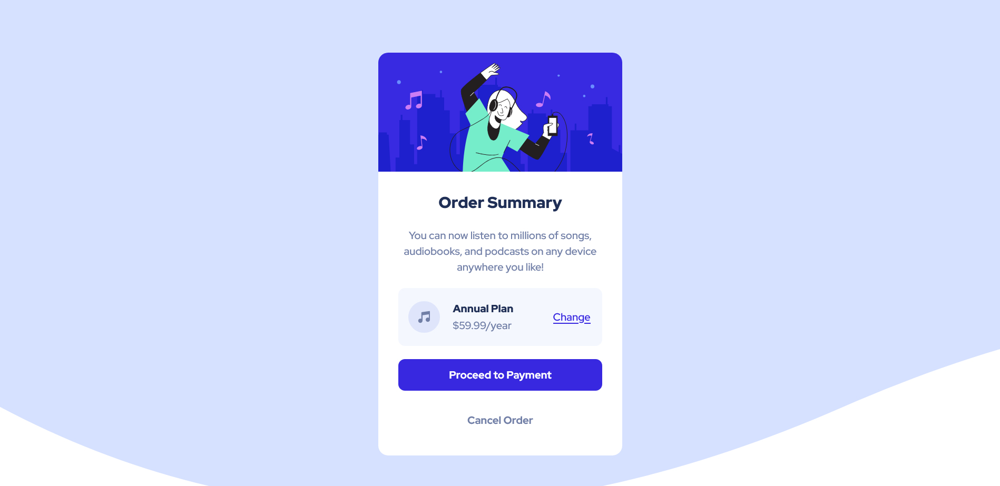

# Frontend Mentor - Order summary card solution

This is a solution to the [Order summary card challenge on Frontend Mentor](https://www.frontendmentor.io/challenges/order-summary-component-QlPmajDUj). Frontend Mentor challenges help you improve your coding skills by building realistic projects.

## Table of contents

- [Overview](#overview)
  - [The challenge](#the-challenge)
  - [Screenshot](#screenshot)
  - [Links](#links)
- [My process](#my-process)

  - [Built with](#built-with)

  - [Useful resources](#useful-resources)

- [Author](#author)

## Overview

### The challenge

Users should be able to:

- See hover states for interactive elements

### Screenshot

### Links

- Solution URL: [Repo](https://github.com/ZeyadTa/Order-Summary-Component-Challenge)
- Live Site URL: [Live Site](https://zeyadta.github.io/Order-Summary-Component-Challenge/)

## My process

### Built with

- Semantic HTML5 markup
- CSS custom properties
- Flexbox
- CSS Grid
- [Styled Components](https://styled-components.com/) - For styles

### Useful resources

- [Using SVG images](https://www.freecodecamp.org/news/use-svg-images-in-css-html/) - This helped me for using SVG images and helped me to know why svg is better than other formats.

## Author

- Website - [Zeyad Tarek](https://www.linkedin.com/in/zeyad-tarek/)
- Facebook - [Zeyad Tarek](https://www.facebook.com/zeyad.tarek.104/)
